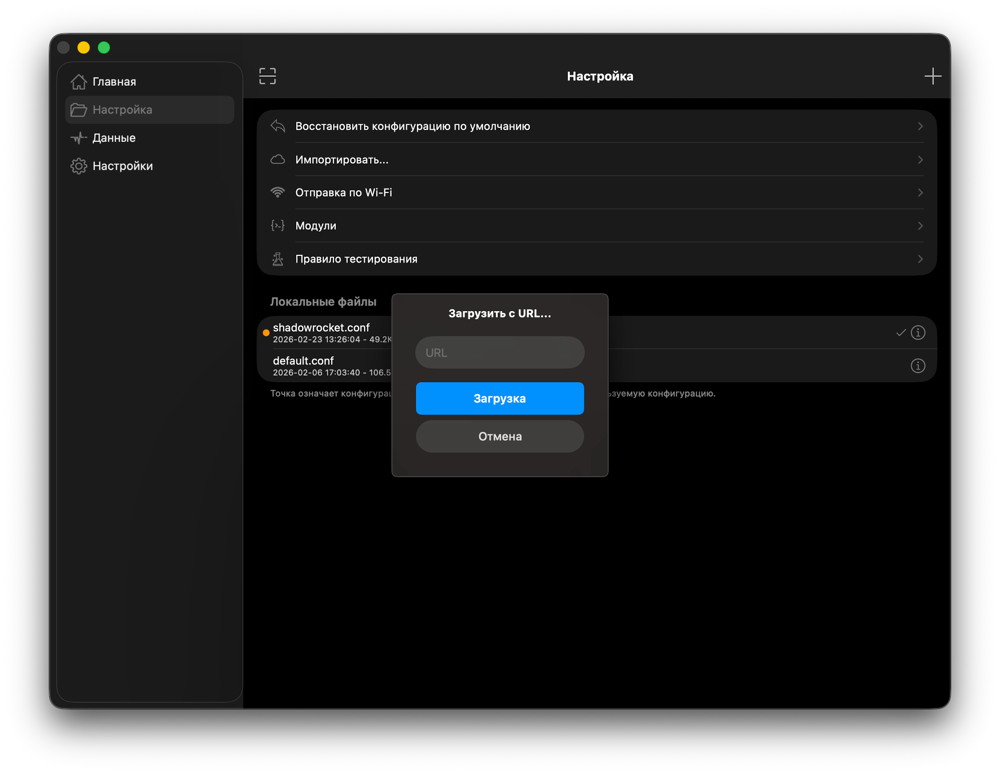
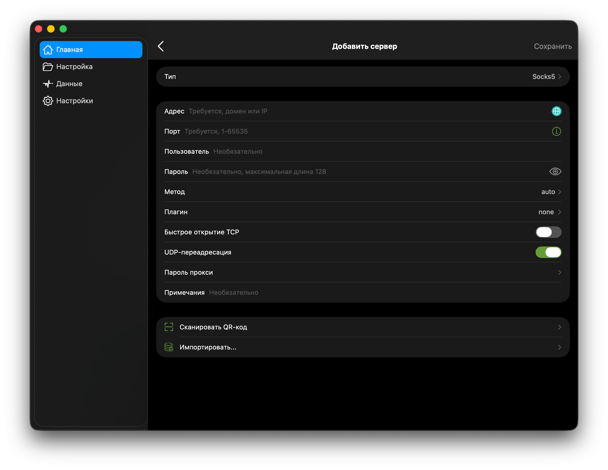
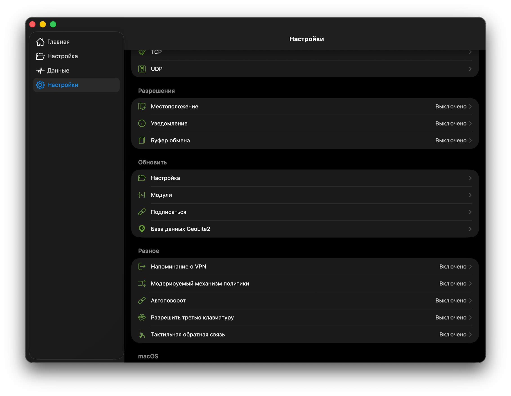
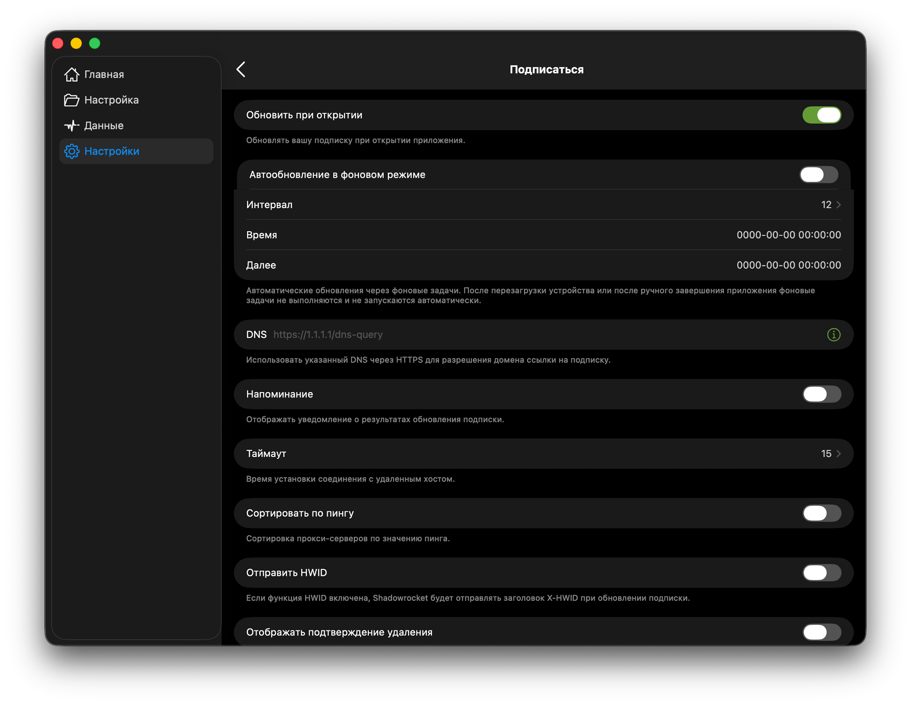

# Proxy Guide

Поддерживаемые платформы: iOS, macOS, Linux, Android, Windows.

---
1. [Приложения](#приложения)
2. [Ссылки на конфигурации](#готовые-ссылки-на-настройки-raw)
3. [Настройка приложений](#настройка-приложений)
     - [ShadowRocket](#iosmacos-shadowrocket)
     - [Clash Verge Rev](#macos--linux--windows-clash-verge-rev)
     - [ClashMetaForAndroid](#android-clashmetaforandroid)
4. [Настройка прокси](#настройка-прокси-в-профиле-clash-verge-rev)
     

---

## Приложения

1. iOS/macOS: [Shadowrocket](https://apps.apple.com/ru/app/shadowrocket/id932747118)
2. macOS/Linux/Windows: [Clash Verge Rev](https://github.com/clash-verge-rev/clash-verge-rev/releases), [Shadowrocket](https://apps.apple.com/ru/app/shadowrocket/id932747118)
3. Android: [ClashMetaForAndroid](https://github.com/MetaCubeX/ClashMetaForAndroid/releases/)

## Готовые ссылки на настройки (RAW)

1. Clash (Clash Verge / ClashMetaForAndroid):  
`https://raw.githubusercontent.com/lebedevweb/proxy-guide/main/settings/ClashVerge.yaml`
2. Shadowrocket:  
`https://raw.githubusercontent.com/lebedevweb/proxy-guide/main/settings/shadowrocket.conf`

## Единая точка изменения правил

Источник правил: `rules/ClashVerge/*.yaml`.

После изменения этих файлов и `push` в GitHub:
1. `ClashVerge.yaml` подтягивает правила по RAW URL.
2. GitHub Actions автоматически генерирует `rules/ShadowRocket/*.list`.
3. `shadowrocket.conf` использует эти `.list` по RAW URL.

---

## Настройка приложений

### iOS/MacOs (Shadowrocket)

1. Установите Shadowrocket.
2. Откройте `Настройка` с папкой -> В правом верхнем углу кнопка `+`.
3. Вставьте URL:  
	 `https://raw.githubusercontent.com/lebedevweb/proxy-guide/main/settings/shadowrocket.conf`

4. Импортируйте кнопкой "Загрузка" и выберите конфигурацию активной.
5. Вернитесь на вкладку `Главная`. В правом верхнем углу нажмите на `+` и добавьте свой `Proxy`. В блоке `Proxy` заполните Тип (Например `socks5`) сервер/порт/логин/пароль вашего прокси. Нажмите `Сохранить`.

6. Для автоматического обновления конфигураций нужно перейти на вкладку `Настройки`, пролистать до блока `Обновить`, войти в пункт `Подписаться`.

7. Активировать `Обновить при открытии`, `Автообновление в фоновом режиме`. `Интервал` можно выставить на 12 часов или любое удобное время.


 ```text
 Внимание!
 
 На iOS/macOS фоновые задачи не всегда срабатывают точно по времени (после перезагрузки/принудительного закрытия приложения чаще нужен запуск приложения вручную).
 ```
6. Включите VPN в Shadowrocket.

---

### macOS / Linux / Windows (Clash Verge Rev)

1. Установите Clash Verge Rev.
2. Откройте `Profiles` -> `New`.
3. Выберите `Type: Remote`.
4. Вставьте URL:  
`https://raw.githubusercontent.com/lebedevweb/proxy-guide/main/settings/ClashVerge.yaml`
5. Сохраните профиль и активируйте его.
6. Откройте `Proxies` и заполните сервер/порт/логин/пароль для `MY-PROXY`.
7. Включите прокси.

---

### Android (ClashMetaForAndroid)

1. Установите ClashMetaForAndroid.
2. Откройте `Profiles` -> `+` -> `Import from URL`.
3. Вставьте URL:  
`https://raw.githubusercontent.com/lebedevweb/proxy-guide/main/settings/ClashVerge.yaml`
4. Сохраните профиль и активируйте его.
5. Откройте прокси `MY-PROXY` и заполните сервер/порт/логин/пароль.
6. Нажмите `Start` для запуска туннеля.

---

## Настройка прокси в профиле (Clash Verge Rev)

Перед импортом профиля заполните блок `proxies` своими данными:

```yaml
proxies:
  - name: MY-PROXY
    type: socks5
    server: 0.0.0.0
    port: 0000
    username: user_name
    password: password
    udp: true
```

---

Источник Voice Ports [ссылка](https://raw.githubusercontent.com/misha-tgshv/shadowrocket-configuration-file/main/rules/voice_ports.list)

---

[Оглавление](#proxy-guide)
